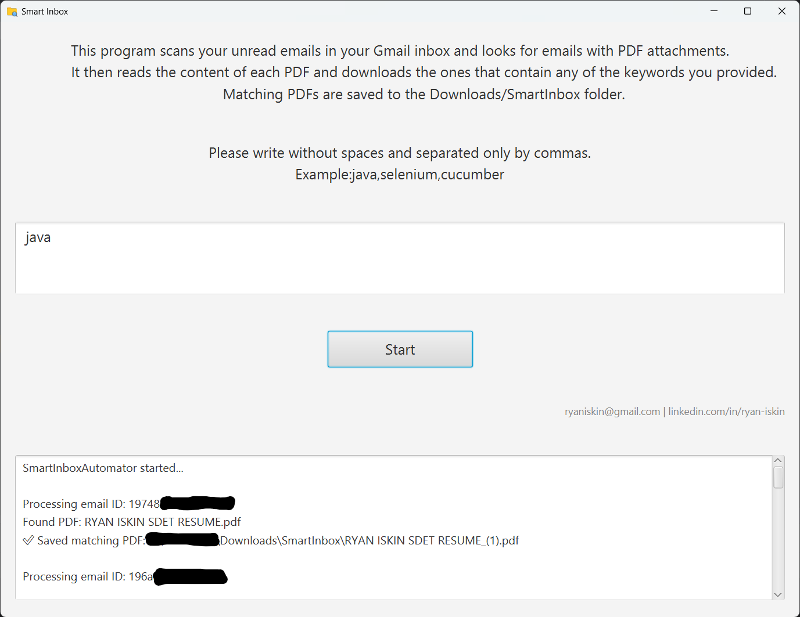

# 📥 SmartInbox Automator

**SmartInbox** is a lightweight desktop tool that scans your **unread Gmail emails** for PDF attachments and automatically downloads the ones that contain your **chosen keywords**. This project is built with **JavaFX** and integrates the **Gmail API**.

> ✅ No background services  
> ✅ Privacy-safe (runs locally)  
> ✅ Only downloads PDFs you care about  
> ✅ Ideal for job seekers, invoice collectors, or anyone handling frequent email documents

---

## 🚀 Features

- Connects securely to your Gmail account
- Scans unread emails with PDF attachments
- Extracts text from each PDF using Apache PDFBox
- Downloads PDFs that contain your specified keywords
- Saves matching files to your `Downloads/SmartInbox` folder
- Clean and user-friendly JavaFX interface

---

## 🖼 Screenshots

> This is the main interface of SmartInbox. Just enter the keywords, click Start, and your unread Gmail PDFs will be scanned and saved automatically.

### 🏠 Main Interface


---

## 🛠 Setup Instructions

Follow below:

### 1. 🔐 Enable Gmail API

1. Go to the [Google Cloud Console](https://console.cloud.google.com/)
2. Create a new project.
3. Enable **Gmail API**.
4. Go to **OAuth Consent Screen** and configure it.
5. Go to **Credentials** > **Create OAuth Client ID** > Desktop app.
6. Download the `credentials.json` and place it in the same directory as the program. (Make sure the name of the json file is `credentials`.)

### 2. 💻 Run the Application

### 🚀 How to Run (Windows)

1. Make sure you have Java 17+ installed.
2. Download the SmartInbox-V1.0.0.zip from the Releases page.
3. Double-click `run-Windows.bat` to launch the app.

### 🚀 How to Run on Mac/Linux

1. Make sure you have Java 17+ installed.
2. Download the SmartInbox-V1.0.0.zip from the Releases page.
3. Extract the ZIP file — it contains SmartInboxJavaFx-1.0.jar and run.sh.
4. Open a terminal in that folder and run:
   ```bash
   chmod +x run.sh
   ./run.sh

Clone this repo:

   ```bash
   git clone https://github.com/ryaniskin/SmartInbox.git
   cd SmartInbox
```

Any questions? LinkedIn: https://www.linkedin.com/in/ryan-iskin

📄 License: [CC BY-NC 4.0](https://creativecommons.org/licenses/by-nc/4.0/)
